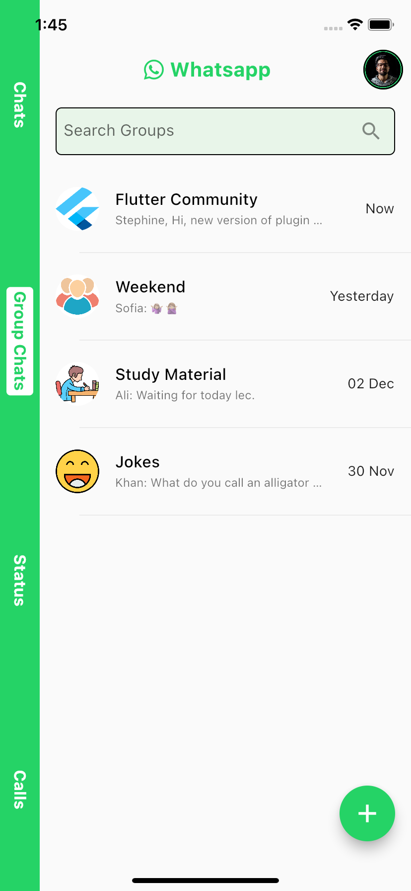

<h1 align="center">Whatsapp UI Redesign with GetX</h1>

# Introduction
This repository contains Whatsapp UI Redesign using Flutter Material Design using GetX state management technique.

## 📱 Screenshots #

    
    

## ⚙️ Built with Amazing Tools
* [Flutter](https://flutter.dev/) - Beautiful native apps in record time.
* [Android Studio](https://developer.android.com/studio/index.html/) - Tools for building Awesome apps on every type of Android device.
* [Visual Studio Code](https://code.visualstudio.com/) - Code editing. Redefined.
* [GetX](https://pub.dev/packages/get/) - Easy State Management tool.

## 🤝 Show Some Support #
If you liked the app please give this repo a ⭐️ 

## 🐞 Bugs/Requests #
If you encounter any problems feel free to open an issue. If you feel the library is missing a feature, please raise a ticket on Github and I'll look into it. Pull request are also welcome.# whatsapp-redesign
